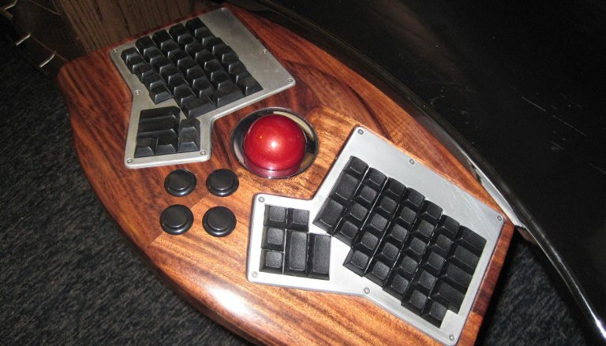
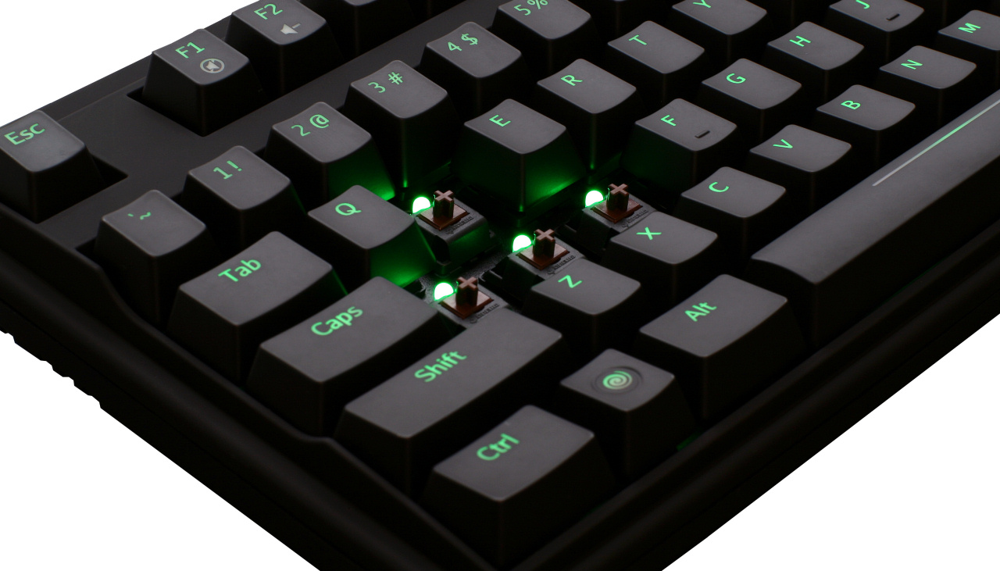
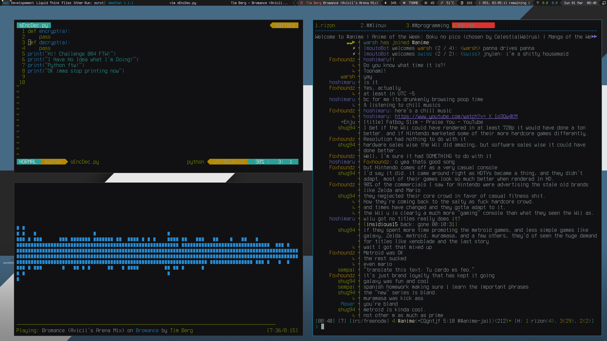
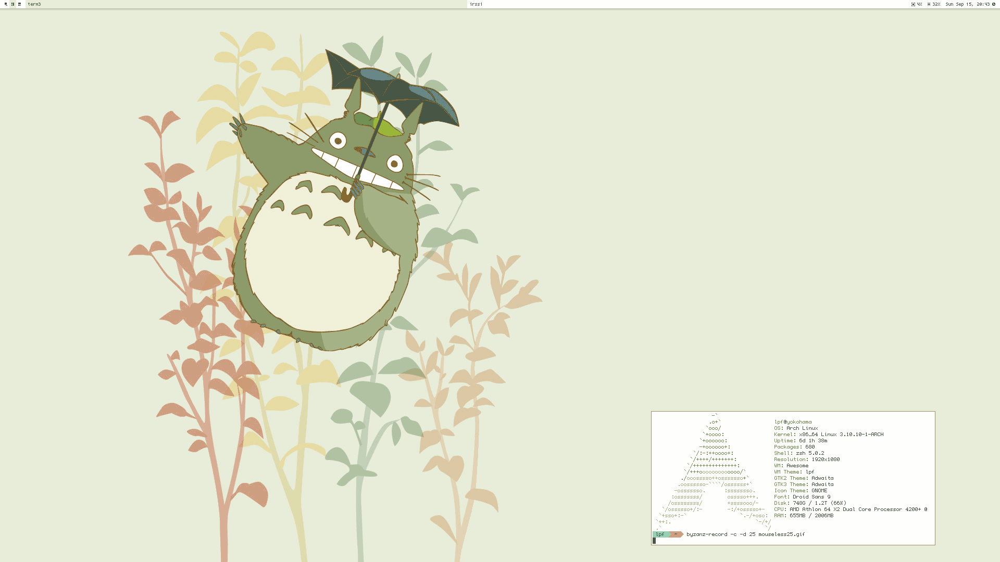

=============
Org interrupt
=============

--------------
Future meetups
--------------

**v01d** is too small; need more room

Discussing this with people at UPJS

This is all tentative and **may change**

* **19.** March: ~ **v01d** (too soon)
* May: ~ **UPJS** (goal)
* July: ~ **v01d** (summer)
* September: ~ **UPJS** (unless it's too early)

---------------------------
meetups @ UPJS - start time
---------------------------

* Closing time is limited to ``19:00``
* ``18:00`` - ``19:00`` is not enough buffer time to account for Slovak factors
* Proposal: **17:40** start time 

------------------------------------------
I have stuff I want to talk about/show off
------------------------------------------

* Send mail to ``kiithsacmp@gmail.com``

* ATM, March is full; there's still space in May.

----
IHRA
----

* Registration ``31.01.2016``
* Games must be sent by ``31.01.2016``
* *almost-no-rules* gamedev competition

  Make a sound-only game or a Sega Dreamcast game or whatever

* Unfortunately you'll have to stick the UPJS logo in there 

  Loading screens work

* ``web.ics.upjs.sk/ihra``

  Or google ``IHRA UPJS``

---------------------
Random tech stuff day
---------------------

---------------------
Random tech stuff day
---------------------

Saturday ``20.02.2016``, ``13:00-17:30`` @v01d (``Narodna Trieda 74``)

Contributors:

* Ferdinand Majerech: **The Keyboard Life**

  Mechanical keyboards, the excentrics around them, and keyboard UIs

* Radoslav Strobl: **DIY Desktop Environment**

  Building a desktop on Awesome; a Lua programmable Window Manager

* Eduard Drusa: **AVR/embedded ghetto style**

  How I built my AVR stack from scratch, and how far it is
  from blinkenlights to a smart home controller

* Lubomir Nagajda & Co.: **Title TBD**

  Content depends on research progress

.. -------------------------------------
.. Ferdinand Majerech: The Keyboard Life
.. -------------------------------------
.. 
.. - Mechanical keyboards and the excentric community around them
.. 
..   * With exemplars to try out and compare
.. 
.. .. image:: ergodox2.png
..    :width: 45%
..    :align: right
.. 
.. .. image:: mxbrown.jpg
..    :width: 45%
.. 
.. ----------------------------------------------------
.. Radoslav Strobl: DIY Desktop Environment (AwesomeWM)
.. ----------------------------------------------------
.. 
.. **EDIT**
.. 
.. - Intro to Awesome - the Lua-programmable window manager
.. - Building a custom desktop environment
.. 
.. .. image:: awesome2.png
..    :width: 45%
..    :align: right
.. 
.. .. image:: awesome.gif
..    :width: 45%
.. 
.. ---------------------------------------
.. Eduard Drusa: AVR/embedded ghetto style
.. ---------------------------------------
.. 
.. **EDIT**
.. 
.. - Basic intro to embedded from scratch
.. - Start point of a start point to building custom input devices/robots/etc.
.. 
.. **NO IDEA ABOUT IMAGES**
.. 
.. ----------------------------------------------
.. Lubomir Nagajda & Co.: (I really have no idea)
.. ----------------------------------------------
.. 
.. **EDIT THIS ESPECIALLY**
.. 
.. - Open source roboticka ruka (3D print + arduino etc..)
.. - Metoda spracovania dat na zaklade kvantovej fyziky.
.. - Statisticky pocitacom generovana rec.
.. 
.. **NO IDEA ABOUT IMAGES**
.. 
.. .. TODO Arisum? Stuff?
