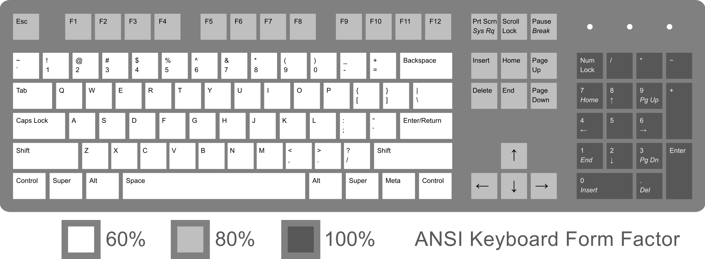
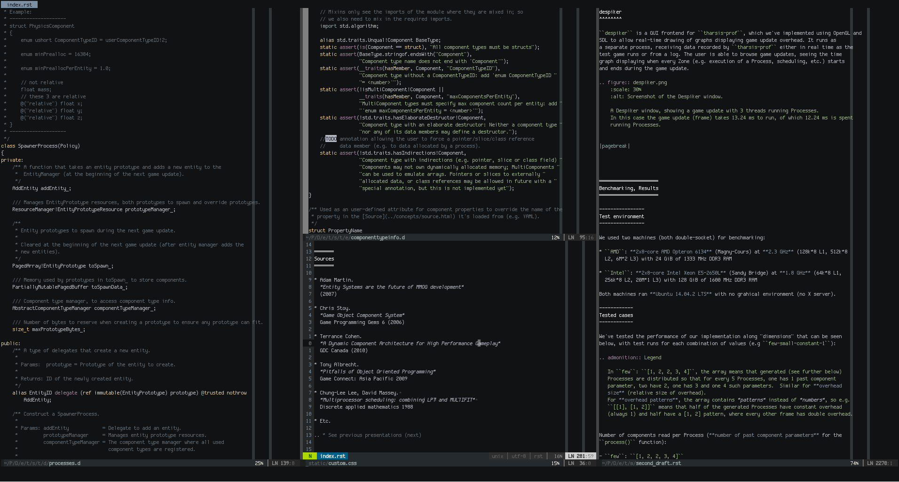

=================
The Keyboard Life
=================

https://github.com/kiith-sa/keyboardlife

http://defenestrate.eu

------------------
A long time ago...
------------------

.. container:: mainimage

   .. image:: modelm_1.jpg
      :width: 100%

.. .. [*] https://webwit.nl/input/kbsim/

---------------
Buckling spring
---------------

http://www.pckeyboard.com/

.. wikipedia

-----------------
Dark Ages (90's+)
-----------------

.. container:: mainimage

   .. image:: rubberdome.jpg

-------------------------------
Return of the Cherry MX (2010+)
-------------------------------

* Market: coders, esports players wanting non-crap keyboards
* Result: expensive keyboards using Cherry MX switches

.. container:: mainimage

   .. image:: mx_wasd.png

..  http://www.wasdkeyboards.com/

---------
Cherry MX
---------

.. image:: mxred.gif
   :width: 24%

.. image:: mxblack.gif
   :width: 24%

.. image:: mxblue.gif
   :width: 24%

.. image:: mxbrown.gif
   :width: 24%

.. image:: mxcomponents.png
   :width: 68%
   :align: center

.. keyboardlover.com
.. wiki.geekhack.org

----------
The Clones
----------

.. image:: clones.png
   :width: 42%
   :align: right

.. http://imgur.com/a/VUqVE

* Cherry MX was patented - until recently
* Clones of variable quality now exist
* More diversity; not always exact clones
* Lower prices or... **higher margins**

... *avoid Kailh/Razer and you'll be fine*

----------
The Others
----------

.. image:: alps.jpg
   :width: 32%
   :align: right

* ALPS
* Topre (magnetic)
* Frankensteins (MX Ergo Clear, Ghetto Green, etc.)
* Custom-designed switches

---------------
Why mechanical?
---------------

* Durable/maintainable; one keyboard for life
* Less hand strain, more predictable/consistent actuation force
* Different switches for different uses/people

  - tactile feedback (e.g. MX Blues) for fast, shallow typing
  - linear low resistance (e.g. MX Reds) for FPS gaming
* **Hackability**, with a community/market of makers/components

.. XXX more?

-----------------------------------------
Custom keyboards: easy (change your keys)
-----------------------------------------

http://www.wasdkeyboards.com/ 

http://www.maxkeyboard.com/max-nighthawk-104-key-custom-mechanical-keyboard.html

.. .. container:: mainimage

----------------------------------------------
Custom keyboards: medium (open source designs)
----------------------------------------------

**ErgoDox** and derived designs, **UHK**, etc.

.. image:: ergodox3.jpg
   :width: 43%

.. image:: diverge.jpg
   :width: 39%

Pre-built: http://falbatech.pl, http://uniquekeyboard.com/store/split-keyboard/diverge-ii

----------------------
Custom keyboards: hard
----------------------

* Do the AVR thing
* Design your layout
* Make your PCB (if you need one)
* Buy some switches (or *design+make* them for *very hard*)
* Buy/print your keykaps
* Print your case

  
.. image:: vertigo.png
   :width: 53.5%
   :align: right

.. image:: vertigo2.png
   :width: 42%

.. http://imgur.com/gallery/ymkOl

===================
Choosing a Keyboard
===================

.. container:: mainimage

   .. image:: choosing.png

-------------------
Consult the Experts
-------------------

* https://mechanicalkeyboards.com/first_mechanical_keyboard.php
* https://www.reddit.com/r/MechanicalKeyboards/wiki/buying_guide
* https://deskthority.net/
* https://deskthority.net/wiki/Main_Page

------
Switch
------

Guide: http://i.imgur.com/cZkte.png

============= ======= ===== ========== ======== ======== ==========
Switch        Tactile Click Force (cN) Gaming*  Typing*  Universal*
============= ======= ===== ========== ======== ======== ==========
MX Red        No      No    45         **8.76** 7.17     7.73
MX Black      No      No    60         8.23     6.64     7.19
MX Brown      Yes     No    45         8.38     8.31     **8.42**
MX Blue       Yes     Yes   50         7.66     **8.94** **8.11**
Topre 35g     Yes     No    35         8.16     6.45     5.15
Topre 45g     Yes     No    45         8.12     **8.61** 7.67
Model M       Yes     Yes   65         7.56     **9.11** 7.99
Gateron Brown No      No    35         **8.67** **8.50** **8.50****
Gateron Clear No      No    35         **8.50** 7.75     7.75
Kailh $COLOR  Bad     Bad   Bad        5-7      5-6      5-7
============= ======= ===== ========== ======== ======== ==========

.. MX Clear      Yes     No    55         **8.56** 7.81     6.35
.. MX Green      Yes     Yes   80         7.67     7.54     7.11

\* : Ratings from https://mechanicalkeyboards.com/mechanical_switches.php

** : Only 4 reviews

-------
O-rings
-------

Helps prevent death by coworker's shotgun

Guide: http://i.imgur.com/FdUlT.png

.. image:: orings.jpg
   :width: 70%

----------
Size/shape
----------

.. https://en.wikipedia.org/wiki/Keyboard_layout

* **Full**: 3D authoring
* **80%**/**Tenkeyless**: Less keyboard/mouse distance

* **75%**: Perfect?
* **60%**: Show off my Pok3r

.. image:: 40.jpg
   :width: 40%
   :align: right

.. https://www.pinterest.com/pin/300826450086219074/

* **40%**: True Masochist
* **ErgoDox**/**Kinesis**/etc: Who gives a shit

.. http://jonathanchu.is/posts/keyboards/

--------
Keyboard
--------

.. image:: mount.png
   :width: 35%
   :align: right

* PCB or plate mounted?
   
  https://deskthority.net/wiki/Switch_mount

* 6KRO? **NKRO**? (how many keys can I press at once?)

  https://deskthority.net/wiki/NKRO

* Keycap plastic/quality?

  https://deskthority.net/wiki/Keycap_construction

------
Extras
------

* Backlight ? RGB ? Programmable ?

  DIY Possibility: mode-dependent individual key backlighting in Vim
* USB hub?
* Macro keys?
* Fully programmable layout? Memory? Layout switching?
* Cable management?
* USB hub?

... Ruler?

-----
Hints
-----

* Take your time, *keyboard for life* deserves days of your time
* Price != quality
* Nice features != good keyboard
* Google for issues with ``$KEYBOARD``
* Don't buy marketing bullshit, buy parameters/reviews
* Read/ask on Reddit/forums/etc.

================
Googlable brands
================

----
WASD
----

.. container:: mainimage

   .. image:: wasd_code.jpg

.. :width: 80%
.. :align: center

------------
Royal Kludge
------------

.. container:: mainimage

   .. image:: royal_kludge.jpg

------------
Das Keyboard
------------

.. container:: mainimage

   .. image:: das.jpg

--------
Rosewill
--------

.. XXX logo
.. .. image:: rosewill_thumb.png
..    :width: 10%
..    :align: left

.. container:: mainimage

   .. image:: rosewill.jpg

-----
Razer
-----

(over there)

-----
Topre
-----

.. image:: topre_thumb.png
   :width: 10%
   :align: left

.. container:: mainimage

   .. image:: topre_realforce.jpg

-------
Unicomp
-------

.. container:: mainimage

   .. image:: unicomp.jpg

------
Cherry
------

.. image:: cherry_thumb.png
   :width: 10%
   :align: left

.. container:: mainimage

   .. image:: cherry.jpg

---
KUL
---

.. container:: mainimage

   .. image:: kul.jpg

-----
Ducky
-----

.. image:: ducky_thumb.png
   :width: 10%
   :align: left

.. container:: mainimage

   .. image:: ducky_full.jpg

-------
Leopold
-------

.. image:: leopold_thumb.png
   :width: 10%
   :align: left

.. container:: mainimage

   .. image:: leopold.jpg

-------
KeyCool
-------

.. image:: keycool_thumb.png
   :width: 10%
   :align: left

.. container:: mainimage

   .. image:: keycool_87.jpg

------
Tesoro
------

.. container:: mainimage

   .. image:: tesoro_tizona.jpg

-----
Filco
-----

.. container:: mainimage

   .. image:: filco_ninjamajestouch.jpg

------------
CoolerMaster
------------

.. container:: mainimage

   .. image:: coolermaster_stormtk.jpg

---------
KBTalking
---------

.. image:: kbtalking_usa_thumb.png
   :width: 10%
   :align: left

.. container:: mainimage

   .. image:: kbtalking_race2.jpg

------
Noppoo
------

.. container:: mainimage

   .. image:: noppoo_chocmini.jpg

----
Deck
----

.. container:: mainimage

   .. image:: deck.jpg

------
Matias
------

.. container:: mainimage

   .. image:: matias_securepro.jpg

---
Tex
---

.. container:: mainimage

   .. image:: tex_yoda.jpg

------
Vortex
------

.. image:: vortex_thumb.png
   :width: 10%
   :align: left

.. container:: mainimage

   .. image:: vortex_pok3r.jpg

-------------
Happy Hacking
-------------

.. XXX logo

.. .. image:: hhkb_thumb.png
..    :width: 10%
..    :align: left

.. container:: mainimage

   .. image:: happyhacking.jpg

----------
KBParadise
----------

.. image:: kbparadise_thumb.png
   :width: 10%
   :align: left

.. container:: mainimage

   .. image:: kbparadise.jpg

-------
Kinesis
-------

.. XXX logo

.. container:: mainimage

   .. image:: kinesis_advantage.jpg

-------
Maltron
-------

.. XXX logo

.. container:: mainimage

   .. image:: maltron.jpg

-----------------------------------
The Ergonomic Keyboard (super crap)
-----------------------------------

.. XXX logo

.. container:: mainimage

   .. image:: tek.jpg

-------
ErgoDox
-------

.. container:: mainimage

   .. image:: ergodox_wood.jpg

---
DIY
---

.. container:: mainimage

   .. image:: custom_ergo.jpg

---
DIY
---

.. container:: mainimage

   .. image:: custom_matrix.jpg

---
DIY
---

.. container:: mainimage

   .. image:: custom_doublematrix.jpg

============
Keyboard UIs
============

-----------
Mouse sucks
-----------

* Need to move hand between keyboard and mouse all the time 

  *over the numpad*, if using a crappy keyboard

* Excessive mouse usage will fuck up your hand

* Moving hand to mouse - moving mouse to target - moving hand back is just slow

  (e.g. selection with copy-pasting)

  I can type a bunch of text in the meanwhile

* On notebooks: excessive touchpad use will fuck up your hand much faster

----------
Ed, Ex, Vi
----------

``Ed``, ``Ex``: ancient history, 'editing languages' rather than 'text editors'
as we know them today

``Vi``: major 'text editor' on Unix in 80's

``Vim``: "Vi Improved", in development, with major user community, new plugins every day

``NeoVim``: Modern attempt to refactor Vim, with some traction

----------------------------
Vim from a 'basic user' view
----------------------------

* I want to edit this text
* WTF why is text not changing
* WTF why did I just delete/move half of my text
* (finds insert mode)

  yeah... this is Notepad with weird clunky features

  (hjkl? WTF?)

  (what's with the weird shortcuts?)

  ... recommends people to press 'i' and use it like crappy Notepad

-----------------------
Vim - what it really is
-----------------------

A text editor built around a text editing **language**.

Those are **not** shortcuts. **language**.

* Use *the language* to move around & edit text from *normal mode*

  Only entering insert mode exacly for the duration of a micro-edit

* Macros, and the ``Ed``/``Ex`` language

  E.g: select all matches of a regex in file, and run a *from* all of these

* No GUI wasting screen space; edit 3 files side by side

* And *daily* plugins trying out experimental features

  Features of Visual Studio 2025, today (EasyMotion, UltiSnips, Suround, Gundo...)

---------------------
Vim language examples
---------------------

==== =====================================================
ib   in parentheses ``()``
ab   *around* parentheses (including them)
vib  *select* in parentheses
cib  *change* in parentheses (rewrite content)
2cib change in 2 levels of parentheses
da"  *delete* around *double quotes*, including the quotes
dit  delete in (between) HTML/XML *tags*
gUe  go *UPPERCASE* to the end of word
gUib go UPPERCASE in parentheses
gUt- go UPPERCASE *till* ``-``
==== =====================================================

**no mouse required**

``cib`` vs mouse select:

* *press c* vs (move hand to mouse/touchpad)
* *press i* vs (drag mouse (touchpad) from paren to paren)
* *press b* vs (press backspace)

------------------
Vim language; GIFs
------------------

.. image:: vim_macros2.gif
   :width: 24%

.. image:: vim_java.gif
   :width: 24%

----------------------------
Vim: the life of improvement
----------------------------

Vim has *mappings*, *scripting* and ever-appearing *plugins*

#. Find repeating usage patterns, input redundancies
#. Turn patterns into mappings, possibly functions, or find plugins
#. Less typing/work/strain from now on
#. Repeat

Result: a *truly integrated* development environment, adapted exactly to the 
needs of the user

*One Vim user may not be able to use another user's Vim*

--------------
Vim's children
--------------

* IDE plugins - these usually miss the 'language' part, and do only 'HJKL'
* Browser plugins
* PDF viewers
* File managers
* Window Managers
* Shell vim-like bindings
* Even games

---------------
Browser plugins
---------------

* Firefox: Vimperator/Pendatactyl, VimFX

  Pentadactyl allows the 'life of improvement' through mappings, etc.
* Chrome: Vimium

Also vim-like *browsers*

(VimFX Demo - move around, open link, go back, mass open links, search)

-----
Shell
-----

* Vi mode in Bash

  Normal mode:

  move around the command line quickly, changing/replacing words, no mouse

(demo)

---------------
Window Managers
---------------

* Awesome, RatPoison, i3...
* Even KDE

(demo)

---------------
And many others
---------------

* Zathura (PDF viewing)
* cmus (music)
* ranger (file manager)
* blender (3D creation)

-----
Games
-----

* Grey Goo

Bindings really matter here (Progaming/esports games)

(TODO)

=======
The End
=======

http://defenestrate.eu

https://github.com/kiith-sa/keyboardlife
